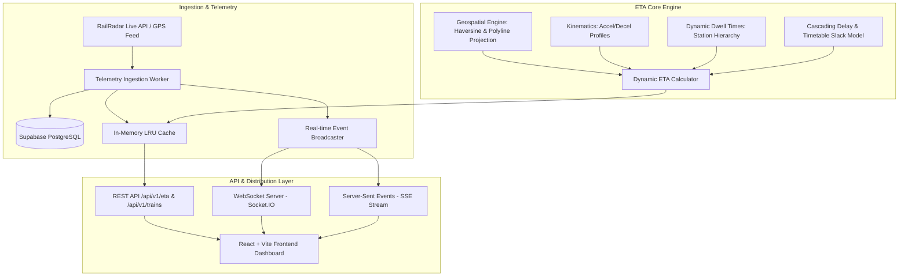

# Dynamic Train ETA Engine (Railwise)

Production-grade, distributed real-time train tracking and dynamic ETA prediction platform with physics-based kinematics, geospatial track-snapping, in-memory LRU caching, and WebSocket/SSE streaming.

---

## 🏗️ System Architecture



---

## 🧮 Core Algorithms & Physics Models

### 1. Geospatial Track-Snapping & Haversine Distance
Great-circle distance between coordinates $(lat_1, lon_1)$ and $(lat_2, lon_2)$:
$$d = 2 R \arcsin \left( \sqrt{\sin^2\left(\frac{\Delta \phi}{2}\right) + \cos(\phi_1)\cos(\phi_2)\sin^2\left(\frac{\Delta \lambda}{2}\right)} \right)$$
where $R = 6371\text{ km}$.

The geospatial engine projects the train's instantaneous GPS coordinates $(P)$ onto the route polyline segment between stations $(A \to B)$ using spherical cross-track and along-track formulas to determine exact remaining track distance.

### 2. Kinematic Acceleration and Deceleration Profiles
For every intermediate platform halt:
- **Deceleration Loss**: Train decelerates from cruising speed $v_c$ to 0 at service braking rate $a_d \approx 0.65\text{ m/s}^2$:
  $$\Delta t_{\text{decel}} = \frac{v_c}{2 a_d}$$
- **Acceleration Loss**: Train accelerates from 0 to $v_c$ at traction acceleration rate $a_a \approx 0.45\text{ m/s}^2$:
  $$\Delta t_{\text{accel}} = \frac{v_c}{2 a_a}$$
- **Total Kinematic Penalty**:
  $$\Delta t_{\text{kinematic}} = \frac{\Delta t_{\text{decel}} + \Delta t_{\text{accel}}}{60} \quad (\text{minutes per halt})$$

### 3. Dynamic Station Hierarchy Dwell Times
Stations are classified into operational tiers:
- **Terminus / Mega Junction** (`NDLS`, `HWH`, `BPL`, `GWL`, `AGC`, `KOTA`): Base dwell = 10–15 mins.
- **Major Junction / Divisional HQ**: Base dwell = 5–10 mins.
- **Standard Intermediate Station**: Base dwell = 2–3 mins.
- **Flag / Roadside Halt**: Base dwell = 1 min.

**Platform Congestion Penalty**: If current delay $> 20$ minutes, an extra $+15\%\text{ to }+35\%$ dwell buffer is applied to account for platform occupancy clearance bottlenecks.

### 4. Cascading Delay Propagation & Timetable Slack Recovery
$$\text{predicted\_delay} = \max\left(0, \text{current\_delay} + \text{cascading\_penalty} - \text{buffer\_recovery}\right)$$
- **Cascading Penalty**: Trains delayed $>15$ mins lose priority slots on multi-track corridors ($+4\%$ delay per intermediate junction ahead).
- **Buffer Recovery**: Timetabled recovery slack allows recovering $\approx 2.5\text{ mins}$ per $100\text{ km}$ of open track.

---

## 🚀 Getting Started

### Prerequisites
- Node.js $\ge 20.0.0$
- Python $\ge 3.10$ (for ML features / training pipeline)
- Supabase account or local PostgreSQL instance

### Environment Variables (`.env`)
Create a `.env` file in the project root:

```env
# Server Configuration
PORT=3000
NODE_ENV=development
API_PREFIX=/api/v1
CORS_ORIGIN=http://localhost:5173,http://localhost:3000

# Database / Supabase
SUPABASE_URL=https://your-project.supabase.co
SUPABASE_ANON_KEY=your-anon-key
SUPABASE_SERVICE_ROLE_KEY=your-service-role-key

# External Telemetry
RAILRADAR_API_KEY=your-api-key

# Caching & Worker
CACHE_TTL_MS=30000
CACHE_MAX_ITEMS=1000
BACKGROUND_SYNC_ENABLED=false
BACKGROUND_SYNC_INTERVAL_MS=300000
```

---

## 🛠️ Running the Application

### 1. Start the Backend API Server
```bash
cd backend
npm install
npm run dev
```
Backend API will start at `http://localhost:3000`.

### 2. Run the Test Suite
```bash
cd backend
npm test
```
Executes all 27 unit and integration test suites covering geospatial calculations, midnight rollover, kinematic curves, LRU caching, and API validation.

### 3. Start the Frontend Dashboard
```bash
cd frontend
npm install
npm run dev
```
Open `http://localhost:5173` in your browser.

---

## 📡 API Reference

### Health Checks
- `GET /health`: Overall server health, uptime, WebSocket connections, and LRU cache metrics.
- `GET /health/db`: Database connectivity verification.

### Trains API
- `GET /api/v1/trains`: List all registered trains.
- `GET /api/v1/trains/search?q=12919`: Search trains by number or name with autocomplete.
- `GET /api/v1/trains/realtime`: Real-time train status with pagination (`?page=1&limit=50`).
- `GET /api/v1/trains/realtime/:trainNumber?journeyDate=YYYY-MM-DD`: Current position and delay for a specific train.
- `GET /api/v1/trains/route/:trainNumber?journeyDate=YYYY-MM-DD`: Ordered station route and distance markers.
- `GET /api/v1/trains/history/:trainNumber?journeyDate=YYYY-MM-DD`: Historical telemetry snapshots.
- `GET /api/v1/trains/stream/:trainNumber?journeyDate=YYYY-MM-DD`: **Server-Sent Events (SSE)** real-time update stream.

### Dynamic ETA Prediction API
- `GET /api/v1/eta/predict?trainNumber=12919&journeyDate=2026-08-30&targetStationCode=NDLS`
  **Response Example**:
  ```json
  {
    "status": "success",
    "data": {
      "train_number": "12919",
      "journey_date": "2026-08-30",
      "current_station": {
        "code": "AGC",
        "name": "Agra Cantt",
        "sequence": 14
      },
      "target_station": {
        "code": "NDLS",
        "name": "New Delhi",
        "sequence": 19
      },
      "distance_remaining_km": 195.0,
      "stations_remaining": 5,
      "intermediate_stops_count": 4,
      "effective_speed_kmph": 82.0,
      "travel_time_minutes": 168,
      "estimated_arrival": "2026-08-30T07:28:00.000Z",
      "estimated_arrival_ist": "30 Aug, 12:58 pm",
      "current_delay_minutes": 24,
      "predicted_delay_minutes": 21,
      "cascading_penalty_minutes": 1.9,
      "buffer_recovery_minutes": 4.9,
      "breakdown": {
        "pure_cruising_minutes": 142.7,
        "intermediate_dwell_minutes": 18.0,
        "kinematic_loss_minutes": 7.3,
        "signal_hold_penalty_minutes": 0,
        "distance_calculation_method": "station_marker_delta"
      },
      "confidence": "high",
      "cached": false
    }
  }
  ```
- `GET /api/v1/eta/route-predict/:trainNumber?journeyDate=YYYY-MM-DD`: Predicts dynamic arrival ETAs for **all downstream stations** along the route in a single call.
- `GET /api/v1/eta/cache/stats`: In-memory cache hit/miss/eviction metrics.
- `POST /api/v1/eta/cache/clear`: Purge in-memory calculation cache.

---

## ⚡ Real-Time Streaming (WebSockets & SSE)

### Socket.IO
Connect to `http://localhost:3000` and emit:
```javascript
socket.emit('subscribe_train', { trainNumber: '12919', journeyDate: '2026-08-30' });
socket.on('train_update', (data) => console.log('Live Telemetry:', data));
```

### Server-Sent Events (SSE)
```javascript
const eventSource = new EventSource('/api/v1/trains/stream/12919?journeyDate=2026-08-30');
eventSource.onmessage = (event) => {
  const data = JSON.parse(event.data);
  console.log('Streamed ETA Update:', data);
};
```
