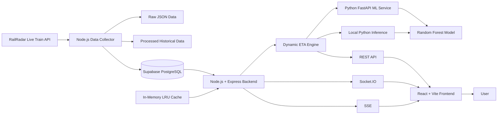
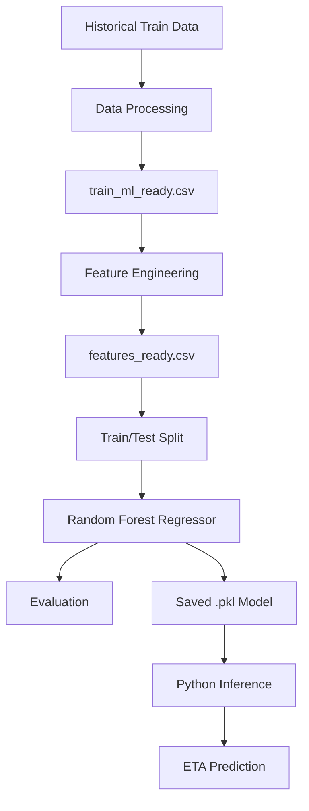
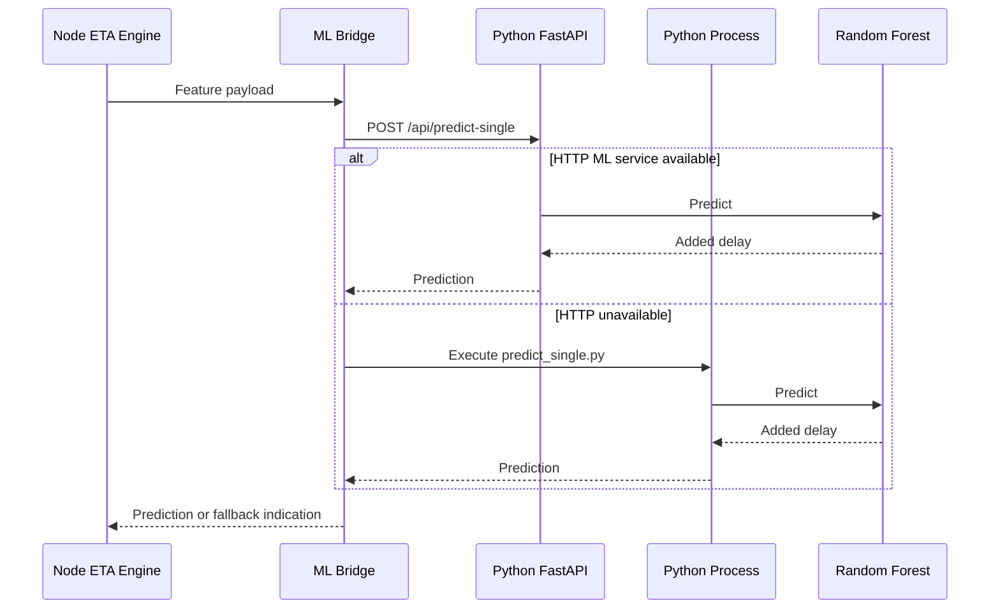
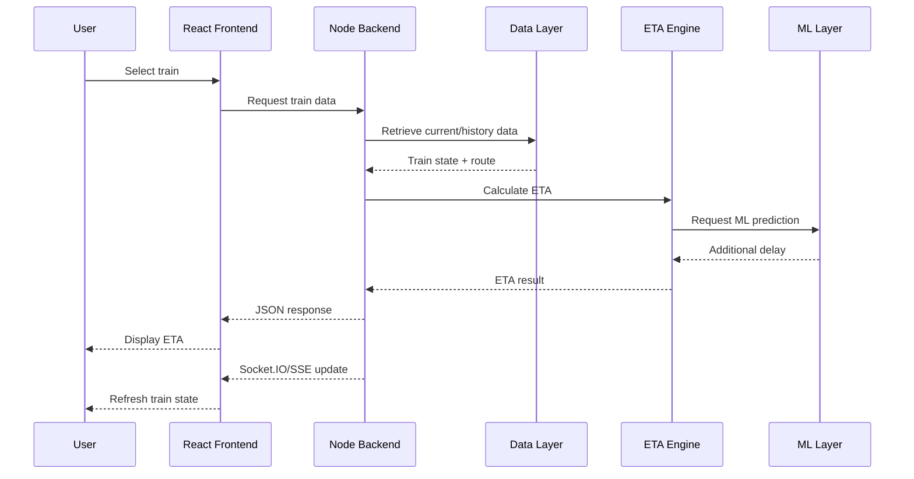
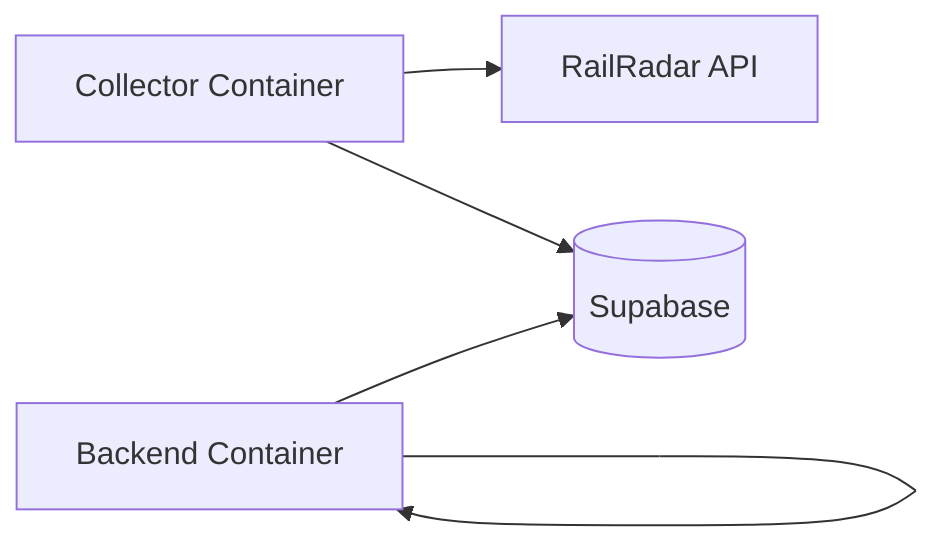
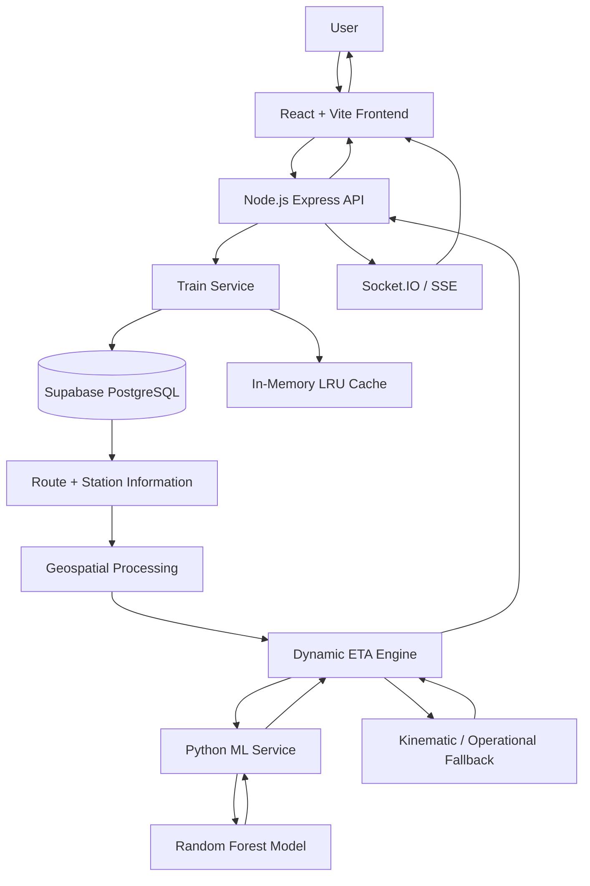
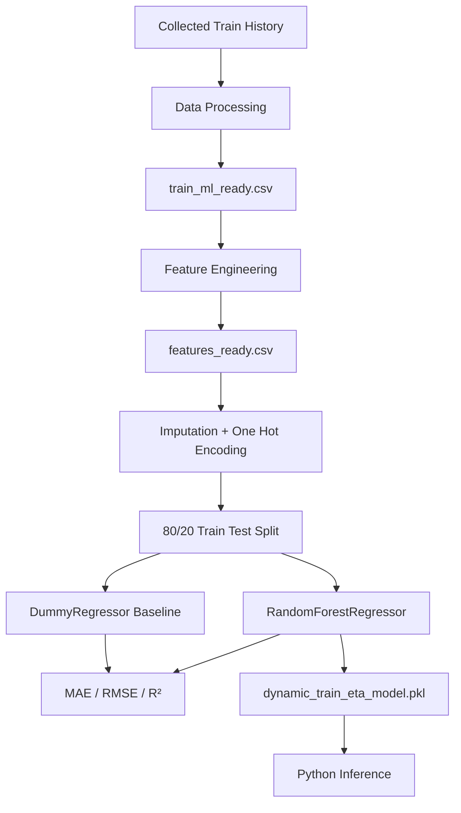
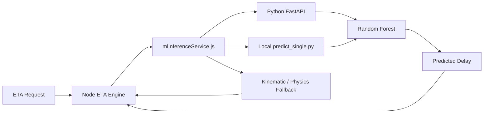
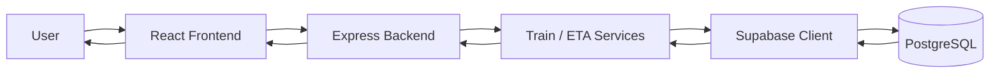
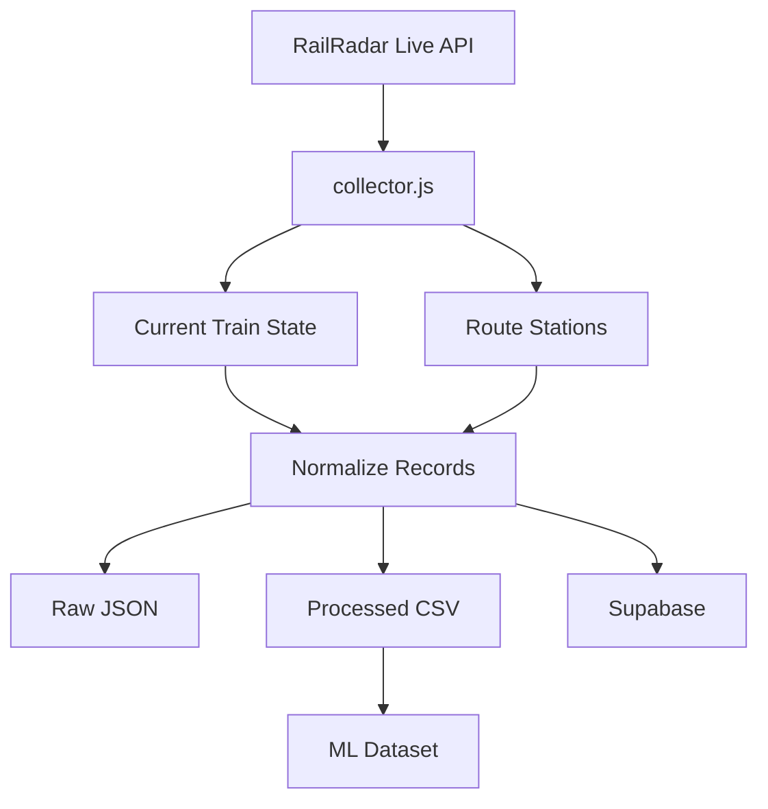

# Dynamic Train ETA

## Overview

**Dynamic Train ETA** is a railway ETA and delay-forecasting platform designed to estimate the expected arrival of a train at downstream stations using current train state, route information, distance, speed, delay information, historical observations, geospatial calculations, operational heuristics, and machine-learning inference.

The repository is implemented as a multi-part system containing:

* A **React + Vite frontend**
* A **Node.js + Express application backend**
* A **Python FastAPI machine-learning service**
* A **Node.js railway data collector**
* **Supabase/PostgreSQL integration**
* **Socket.IO WebSocket communication**
* **Server-Sent Events (SSE)**
* An **in-memory LRU cache with TTL**
* Geospatial and kinematic ETA calculations
* Historical train data processing and ML dataset preparation
* A trained **scikit-learn Random Forest regression model**

The system is therefore more than a train-location display: it contains explicit downstream ETA calculation, delay propagation, machine-learning inference, route-distance computation, and future-station prediction logic.

> **Repository accuracy note:** This README describes functionality that can be verified from the current repository. Where an implementation is incomplete, ambiguous, or inconsistent, that is explicitly identified rather than replaced with an assumption.

---

# Problem Statement

Scheduled railway arrival times represent timetable expectations, but the expected arrival of a train can change after the journey begins.

A train may experience:

* Existing delay
* Changes in speed
* Station dwell time
* Junction-related delay
* Signal holds
* Operational constraints
* Delay propagation
* Partial recovery of timetable buffer
* Different remaining route distances

A dynamic ETA system therefore needs to use the train's **current state** rather than simply displaying its original timetable.

---

# Solution

The repository combines several layers to produce dynamic ETA estimates:

1. Train information is obtained from the railway data layer.
2. Train and route observations can be stored in Supabase.
3. Historical observations are preserved for later processing.
4. The ETA service identifies the current train state and route.
5. Geospatial utilities calculate remaining route distance.
6. The ETA engine considers speed, delay, stations remaining, dwell time, kinematic losses and delay propagation.
7. The Python ML layer can provide predicted additional delay.
8. If ML inference is unavailable, the application has fallback calculation paths.
9. The final prediction is returned through REST APIs.
10. Real-time train updates can be delivered through Socket.IO and SSE.
11. The React frontend presents the train state, route, map, ETA and analytical information.

The resulting ETA is an **estimate**, not a guaranteed arrival time.

---

# Key Features

The current repository implements or contains code for:

* Train search
* Train information retrieval
* Current/realtime train status
* Train route and station information
* Train history retrieval
* Specific-station ETA prediction
* Route-wide downstream ETA prediction
* Live train telemetry
* Dynamic ETA calculation
* Delay propagation
* Timetable-buffer recovery modelling
* Dynamic station dwell estimation
* Station hierarchy classification
* Kinematic acceleration/deceleration loss calculation
* Geospatial Haversine distance
* Track-snapped route distance calculation
* Python machine-learning inference
* Random Forest regression
* ML fallback handling
* In-memory LRU ETA caching
* Cache statistics
* Socket.IO subscriptions
* Server-Sent Events
* Train-status broadcasting
* Supabase/PostgreSQL persistence
* Historical data collection
* ML dataset creation
* Feature engineering
* Model evaluation
* Dockerized backend and collector

The repository also contains frontend components for maps, ETA cards, station tables, journey timelines, delay analytics and train overview information.

---

# System Architecture



The repository explicitly contains the Node.js application server, data collector, Python ML service, model artifacts, Supabase integration, caching layer and real-time communication layer.

---

# End-to-End Data Flow

```text
RailRadar live train API
          ↓
Node.js Data Collector
          ↓
Route / station normalization
          ↓
Raw JSON + processed records
          ↓
Supabase PostgreSQL
          ↓
Node.js backend
          ↓
Current train state + route
          ↓
Geospatial calculations
          ↓
ETA feature construction
          ↓
Dynamic ETA Engine
          ↓
Python ML inference
          ↓
Predicted additional delay
          ↓
ETA / delay propagation
          ↓
REST API
          ↓
React frontend
          ↓
User
```

For real-time communication:

```text
Backend
   ├── Socket.IO
   │      ↓
   │   subscribed frontend clients
   │
   └── SSE
          ↓
      subscribed frontend clients
```

---

# Data Sources

The repository's data documentation identifies the primary external source as the **RailRadar live train-tracking API**.

The documented endpoint pattern is:

```text
https://railradar.in/api/v1/trains/{train_number}/live
```

The data collector uses an authenticated API key and retrieves live train information. The collector operates at approximately five-minute intervals.

| Source                                      | Type                    | Usage                                |
| ------------------------------------------- | ----------------------- | ------------------------------------ |
| RailRadar live train API                    | External/live           | Current train and route observations |
| Supabase `trains`                           | Database                | Train catalog/current train lookup   |
| Supabase `train_history`                    | Database/historical     | Historical train observations        |
| Supabase `train_current_status`             | Database/current status | Current status lookup                |
| `data/raw/`                                 | Local historical/raw    | Preserved API responses              |
| `data/processed/`                           | Local processed data    | ML/data-processing inputs            |
| `ml/data_processing/train_ml_ready.csv`     | ML dataset              | ML dataset preparation               |
| `ml/feature_engineering/features_ready.csv` | Feature dataset         | Model training input                 |
| `data/active-trains.json`                   | Local reference         | Fallback active-train list           |

The repository documentation states that the initial collected dataset was based on live railway tracking observations and originally covered train `12919`. These are historical repository-documented dataset facts, not guarantees about the current live system.

---

# Data Collection Pipeline

The primary collector is:

```text
data-collector/collector.js
```

The collector:

1. Loads environment configuration.
2. Connects to Supabase.
3. Retrieves train numbers from the `trains` table.
4. Falls back to `data/active-trains.json` if necessary.
5. Requests live train information.
6. Extracts route information.
7. Determines the current train location.
8. Normalizes station and timing information.
9. Generates time features using the `Asia/Kolkata` timezone.
10. Saves raw API responses.
11. Generates processed CSV records.
12. Appends ML-oriented records to the processed dataset.
13. Repeats collection approximately every five minutes.

The collector explicitly defines fields including:

* `train_number`
* `train_name`
* `journey_date`
* `station_sequence`
* `station_code`
* `station_name`
* `scheduled_arrival`
* `actual_arrival`
* `scheduled_departure`
* `actual_departure`
* `arrival_delay_minutes`
* `departure_delay_minutes`
* `delay_minutes`
* `distance_from_origin_km`
* `distance_from_last_station_km`
* `distance_remaining_km`
* `speed_kmph`
* `previous_station`
* `current_station`
* `next_station`
* `next_station_code`
* `next_station_sequence`
* `station_status`
* `running_status`
* `is_halt`
* `captured_at`
* `api_updated_at`
* time-derived fields

The collector implementation and data dictionary both document this collection model.

---

# Database Architecture

The application uses Supabase through the Supabase JavaScript client.

```text
Node.js Backend
       ↓
@supabase/supabase-js
       ↓
Supabase
       ↓
PostgreSQL
```

The backend initializes:

* A Supabase client using the configured anonymous key
* An administrative Supabase client using the service-role key when available

The connection test queries:

```text
trains
```

and checks whether the database is reachable.

## Tables referenced by the repository

The source code references at least:

* `trains`
* `train_history`
* `train_current_status`

The SQL/index files also reference these tables.

### `trains`

Used for train catalog information and train-number lookup.

### `train_history`

Used for:

* Historical observations
* Journey history
* ETA prediction inputs
* Current-location records
* ML-related historical data

### `train_current_status`

Used for current train status lookup and indexed by:

```text
train_number
journey_date
```

The repository does not contain one single canonical schema definition covering every column, so this README does not invent a complete database schema.

---

# Database Indexing

The repository contains SQL scripts for database optimization.

`schema_update.sql` defines or references:

```sql
idx_train_history_unique_obs
```

on:

```text
train_number
journey_date
station_sequence
captured_at
```

It also defines indexes for:

```text
train_current_status(train_number, journey_date)
```

and current-location queries on `train_history`.

Additional database scripts exist under:

```text
scripts/
```

and:

```text
data-collector/
```

for indexes and RLS-related configuration.

---

# Backend Architecture

The application backend is implemented using:

* Node.js
* Express
* ES modules
* Supabase
* Socket.IO
* Axios
* Zod
* Express Validator
* Helmet
* CORS
* Compression
* Morgan
* Winston
* Express Rate Limit

The backend requires Node.js `>=20.0.0`.

## Backend structure

```text
backend/
├── src/
│   ├── config/
│   │   └── env.js
│   │
│   ├── routes/
│   │   ├── eta.js
│   │   └── trains.js
│   │
│   ├── services/
│   │   ├── backgroundWorker.js
│   │   ├── etaEngine.js
│   │   ├── etaService.js
│   │   ├── mlInferenceService.js
│   │   ├── supabase.js
│   │   └── trainService.js
│   │
│   ├── utils/
│   │   ├── apiClient.js
│   │   ├── cache.js
│   │   ├── geoUtils.js
│   │   ├── logger.js
│   │   ├── stationMaster.js
│   │   └── timeUtils.js
│   │
│   ├── validators/
│   │   └── index.js
│   │
│   ├── websocket/
│   │   └── handlers.js
│   │
│   └── server.js
│
├── test/
├── Dockerfile
├── docker-compose.yml
├── package.json
└── .env.example
```

---

# `backend/src/server.js`

`server.js` is the main application entry point.

It initializes:

* Express
* HTTP server
* CORS
* Helmet
* Compression
* JSON body parsing
* Morgan logging
* Rate limiting
* Health endpoints
* Train routes
* ETA routes
* Socket.IO
* Background worker
* Graceful shutdown

The standard API prefix is:

```text
/api/v1
```

The backend also mounts compatibility aliases under:

```text
/api/trains
/api/eta
```

The server performs a Supabase connectivity check during startup and can continue in an offline/demo fallback mode if the initial database connection fails.

---

# Backend Routes

## Train Routes

Implemented under:

```text
backend/src/routes/trains.js
```

### Get all trains

```http
GET /api/v1/trains
```

Returns the train catalog.

### Search trains

```http
GET /api/v1/trains/search?q=<query>
```

Searches train information.

### Realtime status

```http
GET /api/v1/trains/realtime
```

Supports filtering and pagination.

### Realtime status for one train

```http
GET /api/v1/trains/realtime/:trainNumber
```

### SSE stream

```http
GET /api/v1/trains/stream/:trainNumber
```

Provides a Server-Sent Events stream for a train journey.

### Train history

```http
GET /api/v1/trains/history
```

### Train history for a journey

```http
GET /api/v1/trains/history/:trainNumber
```

### Train route

```http
GET /api/v1/trains/route/:trainNumber
```

Returns route/station information.

### Train by number

```http
GET /api/v1/trains/:trainNumber
```

The train routes are validated using schemas from:

```text
backend/src/validators/index.js
```

---

# ETA Routes

Implemented under:

```text
backend/src/routes/eta.js
```

## Predict ETA for a target station

```http
GET /api/v1/eta/predict
```

Parameters include:

```text
trainNumber
journeyDate
targetStationCode
targetStationSequence
```

If no target station is provided, the ETA service can use the final terminus.

## Predict ETA for downstream route

```http
GET /api/v1/eta/route-predict/:trainNumber
```

This produces predictions for downstream stations.

## Get live ETA/telemetry

```http
GET /api/v1/eta/live/:trainNumber
```

An optional target station can be provided.

## Cache statistics

```http
GET /api/v1/eta/cache/stats
```

## Clear ETA cache

```http
POST /api/v1/eta/cache/clear
```

The route implementation is directly available in `backend/src/routes/eta.js`.

---

# Health APIs

The backend provides:

```http
GET /health
GET /api/health
GET /health/db
```

The main health endpoint reports:

* Application status
* Database state
* Environment
* Uptime
* WebSocket state
* Connected clients
* Active subscriptions
* Cache statistics

The database health endpoint returns HTTP `503` when the Supabase connection is unhealthy.

---

# Frontend Architecture

The primary frontend is:

```text
frontend/
```

It uses:

* React 18
* React DOM
* Vite 5
* Leaflet
* React Leaflet
* Socket.IO Client
* Lucide React

The package contains:

```text
frontend/
├── App.jsx
├── main.jsx
├── components/
├── hooks/
├── services/
├── styles/
├── utils/
├── public/
├── index.html
├── vite.config.js
└── package.json
```

---

# Frontend Components

The repository contains components including:

```text
DelayAnalytics.jsx
DynamicETACard.jsx
EtaPredictionCard.jsx
JourneyProgressBar.jsx
JourneyTimeline.jsx
LiveRouteMap.jsx
RouteMap.jsx
RouteProgressBar.jsx
SkeletonLoader.jsx
StationScheduleTable.jsx
StationTable.jsx
StatusBadge.jsx
Topbar.jsx
TrainOverviewMetrics.jsx
```

These components cover different aspects of:

* ETA presentation
* Delay analytics
* Route progress
* Station information
* Journey timeline
* Live map visualization
* Status display
* Train overview

---

# Frontend Services

The primary frontend service layer contains:

```text
frontend/services/
├── api.js
├── fallbackData.js
└── websocket.js
```

### `api.js`

Provides frontend-to-backend API communication.

### `websocket.js`

Handles Socket.IO communication.

### `fallbackData.js`

Contains frontend fallback data used when normal backend data is unavailable.

The existence of fallback data should not be interpreted as live railway data.

---

# Frontend Hooks

The frontend includes:

```text
frontend/hooks/
├── useTrainData.js
└── useWebSocket.js
```

These hooks encapsulate train-data and WebSocket interaction for React components.

---

# Machine Learning Architecture

The ML implementation is under:

```text
ml/
```

Its structure includes:

```text
ml/
├── data_processing/
├── feature_engineering/
├── inference/
├── models/
├── notebooks/
├── training/
├── main.py
├── ml_features.py
├── eta_predictions.py
└── prediction_explanations.py
```

The repository contains:

* Data-processing scripts
* Feature-engineering scripts
* Model-training scripts
* Evaluation scripts
* Model artifacts
* Inference scripts
* A FastAPI ML API

---

# ML Data Pipeline

The implemented pipeline is:



---

# ML Data Processing

The repository contains:

```text
ml/data_processing/create_ml_dataset.py
ml/data_processing/explore_data.py
ml/data_processing/test_target_generation.py
ml/data_processing/train_ml_ready.csv
ml/data_processing/validate_data.py
```

The processing layer creates a machine-learning-ready dataset from processed train observations.

---

# Feature Engineering

The main feature engineering implementation is:

```text
ml/feature_engineering/prepare_features.py
```

It loads:

```text
ml/data_processing/train_ml_ready.csv
```

and produces:

```text
ml/feature_engineering/features_ready.csv
```

The script explicitly avoids future information such as:

```text
future_speed_kmph
future_distance_remaining_km
future_distance_from_origin_km
future_captured_at
target_delay_minutes
target_delay_change_minutes
```

This is important because those values would introduce future/target information into model input.

---

# Model Features

The training feature dataset uses the following feature groups.

## Train identity

```text
train_number
```

## Current station

```text
station_code
station_sequence
```

## Current train state

```text
current_delay_minutes
current_speed_kmph
current_distance_from_origin_km
current_distance_remaining_km
```

## Operational state

```text
station_status
running_status
is_halt
```

## Time

```text
day_of_week
hour
minute
month
time_period
is_weekend
```

## Prediction horizon

```text
prediction_horizon_minutes
```

## Future station context

```text
future_station_code
future_station_sequence
```

## Engineered features

```text
route_progress
station_gap
delay_horizon_interaction
speed_horizon_distance
```

The feature engineering implementation creates four additional features:

### `route_progress`

```text
station_sequence / future_station_sequence
```

### `station_gap`

```text
future_station_sequence - station_sequence
```

### `delay_horizon_interaction`

```text
current_delay_minutes × prediction_horizon_minutes
```

### `speed_horizon_distance`

Calculated using the effective speed and prediction horizon.

The implementation uses a default effective speed of:

```text
45 km/h
```

when the current speed is missing or invalid.

---

# ML Preprocessing

The training pipeline uses scikit-learn.

Numeric features use:

```text
SimpleImputer(strategy="median")
```

Categorical features use:

```text
SimpleImputer(strategy="most_frequent")
```

followed by:

```text
OneHotEncoder(handle_unknown="ignore")
```

The preprocessing is included in the scikit-learn pipeline together with the regression model.

---

# How the Model Was Trained

The training script is:

```text
ml/training/train_model.py
```

It loads:

```text
ml/feature_engineering/features_ready.csv
```

and uses:

```text
target_delay_minutes
```

as the prediction target.

The dataset is split using:

```python
train_test_split(
    test_size=0.20,
    random_state=42
)
```

The repository therefore uses an 80/20 train/test split.

---

# Training Algorithm

The definitive training implementation uses:

```text
RandomForestRegressor
```

with:

```text
n_estimators = 300
max_depth = 15
min_samples_split = 4
min_samples_leaf = 2
random_state = 42
n_jobs = -1
```

A `DummyRegressor(strategy="mean")` is also trained as a baseline for comparison.

---

# Model Output

The training target is:

```text
target_delay_minutes
```

Therefore, the ML model is fundamentally trained to predict **delay minutes**, not a raw timestamp.

The ETA layer subsequently combines predicted delay with travel-time calculations to construct an estimated arrival time.

This distinction is important:

```text
Random Forest
      ↓
Predicted delay
      ↓
ETA calculation
      ↓
Estimated arrival time
```

---

# Stored Model Artifacts

The repository currently contains:

```text
ml/models/dynamic_train_eta_model.pkl
ml/models/dynamic_train_eta_realistic_model.pkl
```

It also contains:

```text
model_metrics.txt
multi_date_evaluation.txt
realistic_evaluation.txt
```

The primary model artifact generated by `train_model.py` is:

```text
ml/models/dynamic_train_eta_model.pkl
```

---

# Model Evaluation

The repository contains stored evaluation results.

The recorded training/test sizes are:

```text
Training samples: 2089
Testing samples: 523
```

## Baseline

| Metric |           Value |
| ------ | --------------: |
| MAE    | 24.1477 minutes |
| RMSE   | 42.3328 minutes |
| R²     |         -0.0003 |

## Random Forest

| Metric |           Value |
| ------ | --------------: |
| MAE    |  5.1708 minutes |
| RMSE   | 17.5090 minutes |
| R²     |          0.8289 |

These values are taken directly from the repository's stored `model_metrics.txt`; they are not newly calculated estimates.

The repository does not establish that these metrics represent production/live performance. They are evaluation results for the stored training workflow.

---

# ML Feature Preparation at Inference Time

The runtime ML feature preparation is implemented in:

```text
ml/ml_features.py
```

It:

1. Converts timestamps to Asia/Kolkata.
2. Extracts hour.
3. Extracts day of week.
4. Determines weekend status.
5. Normalizes delay values.
6. Normalizes distance values.
7. Smooths speed.
8. Creates a time-horizon feature.

Speed smoothing uses a rolling window of three observations when train-number grouping is available.

Invalid or zero speeds are replaced using the rolling calculation and ultimately a default speed of:

```text
45 km/h
```

The resulting effective speed is constrained between:

```text
10 km/h
160 km/h
```

---

# Python ML API

The Python ML application is:

```text
ml/main.py
```

It creates a FastAPI application:

```text
Dynamic Train ETA API
```

and runs on:

```text
0.0.0.0:8000
```

when started directly.

---

# Python ML Endpoints

## Health

```http
GET /health
GET /api/health
```

## Single prediction

```http
POST /api/predict-single
```

The single-prediction endpoint accepts a JSON feature payload and returns the model prediction.

The ML application also contains train-search, available-train, train-history and live-ETA endpoints that directly query Supabase.

---

# ML Prediction Service

The primary prediction implementation is:

```text
ml/eta_predictions.py
```

The predictor loads the first available model from its configured model paths.

For each processed train-history row it calculates:

```text
base_travel_minutes
```

using:

```text
distance_remaining_km / effective_speed_kmph × 60
```

It then obtains a predicted additional delay from the loaded model.

The resulting output contains information including:

```text
current_delay_minutes
predicted_added_delay_minutes
total_predicted_delay_minutes
effective_speed_kmph
distance_remaining_km
estimated_arrival_ist
estimated_arrival_iso
```

---

# Node.js ↔ Python ML Integration

The Node backend communicates with Python through:

```text
backend/src/services/mlInferenceService.js
```

The implemented inference sequence is:



The Node service attempts:

1. Python HTTP ML service
2. Local Python child process
3. Physics/kinematic fallback indication

The HTTP service uses:

```text
ML_INFERENCE_URL
```

with a default endpoint of:

```text
http://127.0.0.1:8000/api/predict-single
```

The local fallback executes:

```text
ml/inference/predict_single.py
```

---

# Important ML Implementation Consistency Note

There is an important implementation detail that should not be hidden.

The **training pipeline** uses a feature dataset containing the larger engineered feature set described above.

However, the current `predict_single.py` inference bridge constructs an input containing:

```text
station_sequence
distance_from_origin_km
distance_remaining_km
effective_speed_kmph
delay_minutes
hour_of_day
day_of_week
is_weekend
```

The `ETAPredictor` also defines an eight-column prediction input.

Because the training pipeline and runtime inference paths do not currently expose exactly the same feature schema, model prediction can fail in some execution paths. The runtime code catches prediction failures and has fallback behavior.

This is a significant technical area for future cleanup: **training and inference feature contracts should be made identical and versioned.**

---

# Dynamic ETA Engine

The main ETA calculation engine is:

```text
backend/src/services/etaEngine.js
```

The engine combines:

* Current station/location
* Target station
* Route stations
* Current speed
* Current delay
* GPS location
* Halt state
* Reference time
* ML inference result

The engine can default the target station to the route's final station.

It validates that the target station is downstream of the current train position.

---

# ETA Calculation

The ETA engine uses the following conceptual flow:

```text
Current Train State
        ↓
Current Position
        ↓
Target Station
        ↓
Remaining Stations
        ↓
Remaining Distance
        ↓
Effective Speed
        ↓
Travel Time
        ↓
Station Dwell
        ↓
Kinematic Loss
        ↓
Delay Propagation
        ↓
ML Additional Delay
        ↓
Predicted Arrival
```

---

# Remaining Station Calculation

When route stations are available, the engine uses the ordered station list to identify:

* Current station
* Target station
* Intermediate stations
* Number of remaining stations

The downstream station requirement prevents a target station that has already been passed from being treated as a future destination.

---

# Remaining Distance Calculation

The ETA engine primarily derives remaining distance using the difference between the target station's distance-from-source value and the current station's distance-from-source value.

When live GPS coordinates are available, the engine can use the geospatial track-snapping implementation instead.

---

# Geospatial Processing

Geospatial functionality is implemented in:

```text
backend/src/utils/geoUtils.js
```

The repository implements:

* Degree/radian conversion
* Haversine distance
* Great-circle bearing
* Cross-track distance
* Along-track distance
* Route-segment projection
* Track-snapped polyline distance

The Haversine implementation uses:

```text
Earth radius = 6371.0088 km
```

---

# Track-Snapped Distance

The track-snapping algorithm:

```text
Train GPS location
        ↓
Route segments
        ↓
Project train position onto segments
        ↓
Find closest segment
        ↓
Calculate along-track progress
        ↓
Calculate distance remaining
```

The implementation returns:

```text
distanceRemainingKm
snappedSegmentIndex
currentProgressFraction
crossTrackErrorKm
method
```

Possible distance methods include:

```text
track_snapped_polyline
timetable_distance_marker
direct_haversine_fallback
insufficient_route_points
```

---

# Why Geospatial Processing Matters

ETA depends on how much route remains.

```text
Current GPS Position
        ↓
Route Segment
        ↓
Along-track Position
        ↓
Remaining Route Distance
        ↓
Travel Time
        ↓
ETA
```

Using the direct geographic distance between two points can differ from actual route distance. The track-snapping implementation therefore attempts to calculate remaining distance along the route polyline.

---

# Station Hierarchy

The ETA engine classifies stations into:

```text
TERMINUS
MEGA_JUNCTION
MAJOR_JUNCTION
STANDARD_STATION
FLAG_HALT
```

The classification uses station code/name and other station information.

The implementation contains a predefined set of known major railway junction codes.

---

# Dynamic Dwell Time

Dwell time is calculated using station hierarchy.

The base dwell values implemented in the ETA engine are:

| Station type     | Base dwell |
| ---------------- | ---------: |
| Terminus         |     15 min |
| Mega junction    |     10 min |
| Major junction   |      5 min |
| Standard station |      2 min |
| Flag halt        |      1 min |

If scheduled arrival and departure timestamps are available, the engine can use the scheduled dwell value when appropriate.

For highly delayed trains at mega junctions or termini, the engine applies a congestion multiplier.

These values are implementation heuristics encoded in the current software; they are not learned directly by the Random Forest model.

---

# Kinematic Loss

The ETA engine models acceleration and deceleration losses.

The current constants are:

```text
Acceleration rate = 0.45 m/s²
Deceleration rate = 0.65 m/s²
```

The engine calculates:

```text
accelLossMinutes
decelLossMinutes
totalKinematicLossMinutes
```

Cruising speed is bounded between:

```text
25 km/h
130 km/h
```

for the relevant ETA calculations.

These are software constants rather than values learned from the training dataset.

---

# Delay Propagation

The ETA engine contains explicit delay propagation logic.

Conceptually:

```text
Current Delay
      ↓
Intermediate Junctions
      ↓
Cascading Penalty
      ↓
Timetable Buffer Recovery
      ↓
Net Predicted Delay
```

The implementation considers:

* Current delay
* Remaining distance
* Number of intermediate junctions

For delays of at least 15 minutes and when intermediate junctions exist, a cascading penalty can be introduced.

The engine also calculates possible timetable-buffer recovery.

The maximum possible recovery is bounded using current delay and remaining distance.

These calculations are **heuristic operational logic**, not Random Forest predictions.

---

# Delay Explanation

The ETA engine contains a rule-based "Why Delayed?" explanation generator.

Current root-cause categories include:

```text
Signal Queuing
Junction Congestion
Section Recovery
Speed Restriction
Optimal Clearance
```

The explanation is derived from telemetry conditions such as:

* Current delay
* Effective speed
* Halt status
* Signal hold
* Intermediate junction count

This explanation layer should not be interpreted as a machine-learning causal model.

---

# ETA + ML Integration

The system combines two different forms of reasoning:

### Machine Learning

The Random Forest model predicts:

```text
additional delay minutes
```

### Deterministic / Physics-Informed Logic

The ETA engine calculates:

* Remaining route distance
* Travel time
* Station dwell
* Kinematic loss
* Delay propagation
* Timetable recovery

Therefore:

```text
Current Train State
       ↓
 ┌───────────────┐
 │ Geospatial    │
 │ Calculations  │
 └───────┬───────┘
         ↓
 ┌───────────────┐
 │ ETA Engine    │
 └───────┬───────┘
         │
    ┌────┴─────┐
    ↓          ↓
   ML       Physics /
Inference   Operational
    │          │
    └────┬─────┘
         ↓
    Dynamic ETA
```

This is one of the central architectural characteristics of the repository.

---

# ML Fallback Behavior

The Node ML bridge does not require the Python HTTP service to be continuously available.

Its sequence is:

```text
Try Python HTTP inference
        ↓
If unavailable
        ↓
Try local Python process
        ↓
If unavailable
        ↓
Return fallback indication
        ↓
ETA engine continues with fallback logic
```

The ML bridge explicitly returns:

```text
source: kinematic_physics_fallback
```

when neither ML path succeeds.

---

# Real-Time Architecture

The backend implements two real-time mechanisms:

```text
Socket.IO
SSE
```

Both are implemented in:

```text
backend/src/websocket/handlers.js
```

---

# Socket.IO

Clients can subscribe to a train using:

```text
subscribe_train
```

with:

```text
trainNumber
journeyDate
```

The server creates a room:

```text
trainNumber:journeyDate
```

Clients can later unsubscribe using:

```text
unsubscribe_train
```

The server tracks active subscriptions.

---

# SSE

The train stream endpoint is:

```http
GET /api/v1/trains/stream/:trainNumber
```

The backend creates an SSE stream with:

```text
Content-Type: text/event-stream
```

The connection receives a heartbeat approximately every 20 seconds.

---

# Real-Time Broadcast

Train updates can be broadcast to both:

```text
Socket.IO subscribers
SSE subscribers
```

The payload can represent:

```text
train_update
```

or:

```text
status_change
```

This means the backend can update subscribed clients without requiring every client to repeatedly request the same information.

---

# Real-Time Sequence



---

# Caching

The backend implements a custom in-memory LRU cache in:

```text
backend/src/utils/cache.js
```

It uses:

```text
JavaScript Map
```

with:

* LRU ordering
* TTL expiration
* Maximum item count
* Hit/miss counters
* Set counters
* Eviction counters

Default configuration:

```text
TTL = 30 seconds
Maximum items = 1000
```

These defaults can be configured through environment variables.

---

# ETA Cache Keys

ETA cache keys are generated from:

```text
train number
journey date
target station
current station
speed
delay
```

Speed is bucketed in approximately 5 km/h increments.

Delay is bucketed in approximately 2-minute increments.

This allows near-identical telemetry states to reuse an existing calculation.

---

# Cache Metrics

The cache exposes:

```text
size
maxSize
hits
misses
sets
evictions
hitRatio
```

through:

```http
GET /api/v1/eta/cache/stats
```

It can be cleared using:

```http
POST /api/v1/eta/cache/clear
```

---

# Environment Variables

The backend environment configuration is validated through Zod.

Important variables include:

| Variable                      | Purpose                             |
| ----------------------------- | ----------------------------------- |
| `NODE_ENV`                    | Runtime environment                 |
| `PORT`                        | Backend port                        |
| `API_PREFIX`                  | API prefix                          |
| `DATABASE_URL`                | Optional database URL               |
| `REDIS_URL`                   | Optional Redis URL                  |
| `SUPABASE_URL`                | Supabase project URL                |
| `SUPABASE_ANON_KEY`           | Supabase client key                 |
| `SUPABASE_SERVICE_ROLE_KEY`   | Supabase administrative key         |
| `RAILRADAR_API_KEY`           | RailRadar authentication            |
| `WEATHER_API_KEY`             | Optional weather API configuration  |
| `CORS_ORIGIN`                 | Allowed origins                     |
| `RATE_LIMIT_WINDOW_MS`        | Rate-limit window                   |
| `RATE_LIMIT_MAX_REQUESTS`     | Maximum requests                    |
| `WS_ENABLED`                  | Socket.IO enable/disable            |
| `WS_PING_INTERVAL`            | WebSocket ping interval             |
| `WS_PING_TIMEOUT`             | WebSocket ping timeout              |
| `CACHE_TTL_MS`                | ETA cache TTL                       |
| `CACHE_MAX_ITEMS`             | Cache capacity                      |
| `BACKGROUND_SYNC_ENABLED`     | Background synchronization          |
| `BACKGROUND_SYNC_INTERVAL_MS` | Background synchronization interval |
| `LOG_LEVEL`                   | Winston logging level               |

### Security warning

Do **not** copy credentials from repository `.env` files into documentation.

Environment values should be supplied locally through `.env` or deployment secrets.

The current repository contains environment files, so credential hygiene should be reviewed before production deployment.

---

# Installation

## Prerequisites

The verified backend requirement is:

```text
Node.js >= 20
```

The frontend uses:

```text
Node.js
npm
```

The ML layer requires Python and packages used by the repository such as:

```text
pandas
numpy
scikit-learn
joblib
FastAPI
uvicorn
supabase
python-dotenv
pytz
```

No repository-level Python requirements file was identified, so the exact pinned Python dependency versions are:

> Not documented/verified in the current repository.

---

# Clone the Repository

```bash
git clone https://github.com/praptha-gatty/dynamic-train-eta.git
cd dynamic-train-eta
```

---

# Running the Backend

```bash
cd backend
npm install
npm run dev
```

The backend's development script uses:

```bash
node --watch src/server.js
```

The production start command is:

```bash
npm start
```

which runs:

```bash
node src/server.js
```

The default port is:

```text
3000
```

---

# Running the Frontend

```bash
cd frontend
npm install
npm run dev
```

The frontend is Vite-based.

Build:

```bash
npm run build
```

Preview:

```bash
npm run preview
```

---

# Running the Python ML Service

The Python application is:

```text
ml/main.py
```

When executed directly it starts Uvicorn on:

```text
0.0.0.0:8000
```

A direct execution entry point exists:

```bash
python ml/main.py
```

However, a repository-level Python dependency installation command is not provided.

The required Python environment therefore needs to be created using the dependencies imported by the ML source.

> Exact pinned Python installation instructions are not documented/verified in the current repository.

---

# Running ML Inference Directly

The single prediction script is:

```text
ml/inference/predict_single.py
```

It accepts JSON through standard input or as a command-line argument.

Example structure:

```text
JSON feature payload
        ↓
predict_single.py
        ↓
load .pkl model
        ↓
model.predict()
        ↓
JSON prediction
```

The script returns a structure containing:

```text
status
predicted_added_delay_minutes
model
```

when successful.

---

# Training the Model

The training pipeline expects:

```text
ml/feature_engineering/features_ready.csv
```

The main training command is:

```bash
python ml/training/train_model.py
```

The script:

1. Loads the feature dataset.
2. Separates `target_delay_minutes`.
3. Identifies categorical and numeric columns.
4. Splits data into training and test sets.
5. Creates preprocessing pipelines.
6. Trains a DummyRegressor baseline.
7. Trains RandomForestRegressor.
8. Evaluates MAE, RMSE and R².
9. Saves the model.
10. Saves the metrics.

---

# Feature Preparation

Before training:

```bash
python ml/feature_engineering/prepare_features.py
```

This produces:

```text
ml/feature_engineering/features_ready.csv
```

from:

```text
ml/data_processing/train_ml_ready.csv
```

---

# Data Processing

The repository contains separate data-processing scripts for:

* Dataset creation
* Data exploration
* Target generation testing
* Data validation

These are under:

```text
ml/data_processing/
```

---

# Docker

The root repository contains:

```text
docker-compose.yml
```

The Compose configuration defines:

```text
backend
collector
```

services.

---

# Backend Docker Image

The backend Dockerfile uses:

```text
node:20-alpine
```

and:

```text
dumb-init
```

It installs production dependencies using:

```bash
npm ci --only=production
```

The container exposes:

```text
3000
```

and runs:

```text
node src/server.js
```

The container also switches to the non-root `node` user.

---

# Docker Compose Architecture



The actual Compose file creates a bridge network:

```text
train-eta-network
```

The backend is mapped by default to:

```text
3000:3000
```

The collector mounts:

```text
./data:/app/data
```

and both services are configured with restart policies.

---

# Testing

Backend tests are located under:

```text
backend/test/
```

Current test files include:

```text
api.test.js
cache.test.js
etaEngine.test.js
geoUtils.test.js
timeUtils.test.js
```

The backend package defines:

```bash
npm test
```

which executes those test files using Node's test runner.

---

# Testing Areas

The repository contains tests for:

### API

```text
api.test.js
```

### Cache

```text
cache.test.js
```

### ETA engine

```text
etaEngine.test.js
```

### Geospatial calculations

```text
geoUtils.test.js
```

### Time utilities

```text
timeUtils.test.js
```

No verified project-wide code-coverage percentage is documented.

---

# Validation and Error Handling

The backend uses:

```text
Zod
express-validator
```

for request/environment validation.

The application also has centralized error handling.

Unexpected errors are returned in structured JSON rather than raw HTML.

In production, generic HTTP 500 errors are returned as:

```text
Internal server error
```

while development responses can include stack information.

---

# Security

## Implemented

The backend includes:

* Helmet
* CORS middleware
* Rate limiting
* Request validation
* Environment-variable configuration
* Structured logging
* Production/non-production error distinction
* Non-root Docker execution

Dependencies include:

```text
helmet
express-rate-limit
express-validator
zod
```

## Important production consideration

The current CORS implementation is intentionally permissive in the backend development configuration and accepts origins even after the configured-origin checks.

This should be tightened before production deployment.

Authentication and authorization for application users are not documented as an implemented backend feature.

---

# Logging

The backend uses:

```text
Winston
Morgan
```

Logging levels are configured through:

```text
LOG_LEVEL
```

The environment configuration supports levels including:

```text
error
warn
info
http
verbose
debug
silly
```

---

# Background Worker

The backend contains:

```text
backend/src/services/backgroundWorker.js
```

The server can start the worker when:

```text
BACKGROUND_SYNC_ENABLED=true
```

The configured default synchronization interval is:

```text
300000 ms
```

or approximately five minutes.

The exact set of background synchronization operations should be treated according to the current worker implementation rather than inferred from the variable name alone.

---

# User Flow

The primary application flow is:

```text
1. User opens the React application.
        ↓
2. User searches/selects a train.
        ↓
3. Frontend requests train information.
        ↓
4. Node.js backend validates the request.
        ↓
5. Train service retrieves current/history information.
        ↓
6. Route and station information is obtained.
        ↓
7. Current train state is identified.
        ↓
8. Remaining distance/stations are calculated.
        ↓
9. ETA engine constructs the prediction.
        ↓
10. ML inference is attempted.
        ↓
11. Delay propagation and ETA calculations are applied.
        ↓
12. Backend returns the prediction.
        ↓
13. React displays ETA and route information.
        ↓
14. Socket.IO/SSE can provide subsequent updates.
```

---

# How Accurate ETA Is Produced

The system does not guarantee arrival accuracy.

The prediction depends on:

* Quality of live train information
* Freshness of telemetry
* Route information
* Station sequence
* Speed data
* Current delay
* Remaining distance
* Historical training data
* Model quality
* Operational heuristics
* Data availability

The architecture attempts to improve the ETA by combining multiple sources of information rather than using timetable time alone.

---

# Accuracy vs Prediction

The stored Random Forest evaluation reports:

```text
MAE  = 5.1708 minutes
RMSE = 17.5090 minutes
R²   = 0.8289
```

These are model-evaluation results from the repository's stored evaluation artifact.

They should **not** be interpreted as:

* Guaranteed live ETA accuracy
* Guaranteed production performance
* Accuracy across every Indian railway route
* Accuracy for every train
* Accuracy under every operational condition

The model was evaluated against the repository's training/test data.

---

# Why This Is Not Just Train Tracking

## Traditional tracking

A tracking system answers:

```text
Where is the train now?
```

For example:

```text
Current station
Current coordinates
Current speed
Current delay
```

## Dynamic ETA forecasting

This repository additionally attempts to answer:

```text
Given the train's current state,
what is the expected future arrival time
at downstream stations?
```

The distinction comes from the implementation of:

* Target-station prediction
* Route-wide prediction
* Remaining-distance calculation
* Speed-based travel-time calculation
* Station dwell estimation
* Kinematic loss
* Delay propagation
* Buffer recovery
* Random Forest delay prediction
* Future-station ETA generation

Therefore the core system is not limited to showing current train position.

---

# Complete System Flowchart



---

# ML Training Flowchart



---

# Backend ↔ ML Flowchart



---

# Database ↔ Backend ↔ Frontend Flowchart



---

# Data Collection Flowchart



---

# Complete File Structure

The repository currently contains the following major structure:

```text
dynamic-train-eta/
│
├── .gitignore
├── README.md
├── package.json
├── package-lock.json
├── docker-compose.yml
├── schema_update.sql
│
├── backend/
│   ├── .env
│   ├── .env.example
│   ├── .gitignore
│   ├── Dockerfile
│   ├── README.md
│   ├── docker-compose.yml
│   ├── package.json
│   ├── package-lock.json
│   │
│   ├── src/
│   │   ├── config/
│   │   │   └── env.js
│   │   │
│   │   ├── routes/
│   │   │   ├── eta.js
│   │   │   └── trains.js
│   │   │
│   │   ├── services/
│   │   │   ├── backgroundWorker.js
│   │   │   ├── etaEngine.js
│   │   │   ├── etaService.js
│   │   │   ├── mlInferenceService.js
│   │   │   ├── supabase.js
│   │   │   └── trainService.js
│   │   │
│   │   ├── utils/
│   │   │   ├── apiClient.js
│   │   │   ├── cache.js
│   │   │   ├── geoUtils.js
│   │   │   ├── logger.js
│   │   │   ├── stationMaster.js
│   │   │   └── timeUtils.js
│   │   │
│   │   ├── validators/
│   │   │   └── index.js
│   │   │
│   │   ├── websocket/
│   │   │   └── handlers.js
│   │   │
│   │   └── server.js
│   │
│   └── test/
│       ├── api.test.js
│       ├── cache.test.js
│       ├── etaEngine.test.js
│       ├── geoUtils.test.js
│       └── timeUtils.test.js
│
├── data-collector/
│   ├── collector.js
│   ├── discover-trains.js
│   ├── discovered-trains.json
│   ├── db_stations.json
│   ├── extract_stations.js
│   ├── generate_catalog.js
│   ├── backfill_train_history.js
│   ├── backfill_train_history.sql
│   ├── create-ml-target.js
│   ├── prepare-ml-dataset.js
│   ├── ingest.py
│   ├── server.js
│   ├── quality-report.js
│   ├── verify-supabase.js
│   ├── sync_station_master.js
│   ├── schema_indexes.sql
│   ├── test-collector-run.js
│   ├── test-route-sync.js
│   ├── test-supabase.js
│   └── Dockerfile.collector
│
├── data/
│   ├── active-trains.json
│   ├── app.js
│   ├── index.html
│   ├── style.css
│   ├── package.json
│   ├── package-lock.json
│   ├── vite.config.js
│   ├── raw/
│   ├── processed/
│   └── src/
│
├── docs/
│   └── data-dictionary.md
│
├── frontend/
│   ├── .env
│   ├── App.jsx
│   ├── main.jsx
│   ├── index.html
│   ├── vite.config.js
│   ├── package.json
│   ├── package-lock.json
│   ├── components/
│   ├── hooks/
│   ├── services/
│   ├── styles/
│   ├── utils/
│   ├── public/
│   └── dist/
│
├── ml/
│   ├── data_processing/
│   │   ├── create_ml_dataset.py
│   │   ├── explore_data.py
│   │   ├── test_target_generation.py
│   │   ├── train_ml_ready.csv
│   │   └── validate_data.py
│   │
│   ├── feature_engineering/
│   │   ├── prepare_features.py
│   │   └── features_ready.csv
│   │
│   ├── inference/
│   │   ├── predict_eta.py
│   │   ├── predict_eta_backup.py
│   │   └── predict_single.py
│   │
│   ├── models/
│   │   ├── dynamic_train_eta_model.pkl
│   │   ├── dynamic_train_eta_realistic_model.pkl
│   │   ├── model_metrics.txt
│   │   ├── multi_date_evaluation.txt
│   │   └── realistic_evaluation.txt
│   │
│   ├── notebooks/
│   ├── training/
│   │   ├── train_model.py
│   │   ├── evaluate_model.py
│   │   └── analyze_performance.py
│   │
│   ├── main.py
│   ├── ml_features.py
│   ├── eta_predictions.py
│   └── prediction_explanations.py
│
├── scripts/
│   ├── dashboard_indexes.sql
│   ├── rls_policies_and_indexes.sql
│   ├── schema_lookup_index.sql
│   └── sync_trains.py
│
└── vscode/
```

Some directories contain additional files not enumerated above. Where the repository contains generated/cache artifacts such as `__pycache__`, those are not treated as application architecture.

---

# Important Files Explained

| File                                         | Responsibility                            |
| -------------------------------------------- | ----------------------------------------- |
| `backend/src/server.js`                      | Starts and configures the Node.js backend |
| `backend/src/routes/trains.js`               | Train REST endpoints                      |
| `backend/src/routes/eta.js`                  | ETA and cache REST endpoints              |
| `backend/src/services/trainService.js`       | Train data operations                     |
| `backend/src/services/etaService.js`         | ETA service orchestration                 |
| `backend/src/services/etaEngine.js`          | Dynamic ETA calculation                   |
| `backend/src/services/mlInferenceService.js` | Node/Python ML bridge                     |
| `backend/src/services/supabase.js`           | Supabase client and connectivity          |
| `backend/src/services/backgroundWorker.js`   | Optional background synchronization       |
| `backend/src/utils/geoUtils.js`              | Geospatial calculations                   |
| `backend/src/utils/cache.js`                 | In-memory LRU cache                       |
| `backend/src/utils/timeUtils.js`             | Time handling                             |
| `backend/src/utils/stationMaster.js`         | Station-related reference logic           |
| `backend/src/validators/index.js`            | Request validation                        |
| `backend/src/websocket/handlers.js`          | Socket.IO and SSE                         |
| `frontend/App.jsx`                           | Main React application                    |
| `frontend/services/api.js`                   | Frontend API communication                |
| `frontend/services/websocket.js`             | Socket.IO client                          |
| `frontend/hooks/useTrainData.js`             | Train data React hook                     |
| `frontend/hooks/useWebSocket.js`             | WebSocket React hook                      |
| `ml/main.py`                                 | FastAPI ML service                        |
| `ml/ml_features.py`                          | Runtime ML feature preparation            |
| `ml/eta_predictions.py`                      | ETA prediction implementation             |
| `ml/inference/predict_single.py`             | Single-model inference bridge             |
| `ml/feature_engineering/prepare_features.py` | Training feature creation                 |
| `ml/training/train_model.py`                 | Random Forest training                    |
| `ml/training/evaluate_model.py`              | Model evaluation                          |
| `ml/models/*.pkl`                            | Stored model artifacts                    |
| `data-collector/collector.js`                | Live train-data collection                |
| `docs/data-dictionary.md`                    | Dataset documentation                     |

---

# Technology Stack

| Layer                | Technology            | Actual usage                  |
| -------------------- | --------------------- | ----------------------------- |
| Frontend             | React 18              | UI                            |
| Frontend build       | Vite 5                | Development/build             |
| Maps                 | Leaflet               | Map rendering                 |
| React maps           | React Leaflet         | React map components          |
| Icons                | Lucide React          | UI icons                      |
| Realtime client      | Socket.IO Client      | Frontend realtime updates     |
| Backend              | Node.js               | Application server            |
| API                  | Express               | REST API                      |
| Database client      | Supabase JS           | PostgreSQL access             |
| Database             | Supabase/PostgreSQL   | Train and history storage     |
| Validation           | Zod                   | Environment/schema validation |
| Validation           | Express Validator     | Request validation            |
| Realtime server      | Socket.IO             | WebSocket communication       |
| Streaming            | SSE                   | Server-Sent Events            |
| HTTP                 | Axios                 | External/API communication    |
| Logging              | Winston               | Structured logging            |
| HTTP logging         | Morgan                | Request logging               |
| Security headers     | Helmet                | HTTP security headers         |
| Rate limiting        | Express Rate Limit    | Request limiting              |
| Compression          | Compression           | HTTP compression              |
| ML language          | Python                | ML layer                      |
| ML API               | FastAPI               | Python inference service      |
| ML framework         | scikit-learn          | Model training/inference      |
| ML algorithm         | RandomForestRegressor | Delay prediction              |
| Data processing      | Pandas                | Dataset processing            |
| Numerical processing | NumPy                 | Numerical calculations        |
| Model serialization  | Joblib                | Model persistence             |
| Timezone             | pytz                  | IST conversion                |
| Containerization     | Docker                | Backend/collector containers  |

The technologies above are derived from the current package manifests and Python source imports.

---

# Development Flow

## Frontend change

Modify:

```text
frontend/
```

Common areas:

```text
frontend/components/
frontend/hooks/
frontend/services/
frontend/App.jsx
```

## API change

Modify:

```text
backend/src/routes/
```

## Train-data logic

Modify:

```text
backend/src/services/trainService.js
```

## ETA logic

Modify:

```text
backend/src/services/etaEngine.js
backend/src/services/etaService.js
```

## ML bridge

Modify:

```text
backend/src/services/mlInferenceService.js
```

## Geospatial logic

Modify:

```text
backend/src/utils/geoUtils.js
```

## Training feature engineering

Modify:

```text
ml/feature_engineering/prepare_features.py
```

## Model training

Modify:

```text
ml/training/train_model.py
```

## ML inference

Modify:

```text
ml/inference/
```

## Data collection

Modify:

```text
data-collector/collector.js
```

---

# Important Design Characteristics

## Node.js for application orchestration

The backend handles:

* HTTP APIs
* database access
* realtime connections
* request validation
* caching
* ETA orchestration

## Python for ML

Python is separated into an ML layer so the trained scikit-learn model can be consumed through FastAPI or a local Python process.

## Supabase for persistence

Supabase provides PostgreSQL-backed storage for train and historical information.

## LRU cache

The in-memory cache reduces repeated ETA calculations for similar telemetry states.

## Socket.IO and SSE

Two realtime mechanisms are implemented so clients can receive train updates without depending exclusively on repeated REST requests.

## Physics + ML

The ETA engine does not delegate the entire ETA calculation to machine learning. The Random Forest predicts delay minutes while deterministic calculations handle travel distance, speed, dwell, kinematics and delay propagation.

---

# Limitations

## Data coverage

The repository's documented initial dataset was collected from one train and a limited collection period.

The initial data dictionary reports:

```text
264 observations
1 unique train
107 unique stations
5 collection timestamps
```

These values represent the historical dataset state at the time of that documentation and should not be interpreted as current production coverage.

## External data dependency

Live operation depends on the availability and quality of the external train-tracking data source.

## ML training/inference feature mismatch

The training feature schema and runtime eight-feature inference schema are not currently identical.

This should be resolved before treating the ML inference path as a fully consistent production model-serving contract.

## Python dependency specification

A canonical pinned Python requirements file was not verified in the repository.

## Authentication

Application-level user authentication/authorization is not verified as implemented.

## CORS

The backend's current development-oriented CORS behavior is permissive and should be tightened for production.

## Model monitoring

Automated production model monitoring and drift detection are not verified.

## Model retraining

The repository contains training scripts, but a fully automated production retraining and deployment pipeline is not verified.

## Prediction uncertainty

The repository produces predicted delay and ETA values, but a formally calibrated probabilistic ETA interval is not verified.

## External factors

The current dataset documentation explicitly states that weather is not included.

---

# Future Enhancements

The following are **future possibilities**, not claims about current implementation.

## Data

* Increase historical journey coverage.
* Collect observations across many trains and routes.
* Add more reliable real-time railway feeds.
* Integrate weather observations.
* Add railway operational events.
* Add section/signal information where legally and technically available.
* Add track occupancy information.

## Machine Learning

* Unify training and inference feature schemas.
* Version the feature contract.
* Automate retraining.
* Add model versioning.
* Add model registry support.
* Add model drift detection.
* Add route-specific validation.
* Evaluate across multiple train routes.
* Add probabilistic ETA intervals.
* Add calibrated prediction uncertainty.
* Compare Random Forest against gradient boosting and other models.
* Add automated feature-importance monitoring.

## Infrastructure

* Replace single-process in-memory cache with distributed caching where required.
* Add Redis for multi-instance deployments.
* Introduce message queues for high-volume ingestion.
* Add worker scaling.
* Add centralized observability.
* Add structured production metrics.
* Add distributed tracing.

## Frontend

* More detailed station-level ETA visualization.
* Delay alerts.
* Passenger notification workflows.
* Better accessibility.
* More extensive multilingual support.
* More detailed prediction explanations.
* Improved mobile experience.

## Railway Operations

Potential future operational capabilities include:

* Control-room dashboards
* Disruption simulation
* Platform occupancy information
* Route conflict analysis
* Operational decision support
* Connection-risk prediction

These are proposed enhancements only and are not represented as existing repository functionality.

---

# Roadmap

```text
Current System
      ↓
Improve Data Coverage
      ↓
Unify ML Training + Inference Contract
      ↓
Automated Model Validation
      ↓
Model Monitoring + Drift Detection
      ↓
Distributed Real-Time Infrastructure
      ↓
Probabilistic ETA
      ↓
Operational Intelligence
      ↓
Production Railway Deployment
```

---

# Security and Production Checklist

Before production deployment:

* Rotate any credentials that may have been exposed.
* Keep `.env` files out of source control.
* Use deployment secret management.
* Tighten CORS.
* Add application authentication if required.
* Review Supabase RLS policies.
* Review service-role-key usage.
* Add production HTTPS.
* Add centralized monitoring.
* Add model-version tracking.
* Add ML feature-schema validation.
* Add automated database migration management.
* Review external API terms and redistribution permissions.

The repository's data documentation specifically notes that the RailRadar data is collected through authenticated API access and that redistribution rights should be confirmed before publicly redistributing raw API responses.

---

# How the System Works — Simple Explanation

1. The system receives train information from the live railway tracking data source.
2. The data collector extracts the train's current state and route.
3. Observations can be stored in Supabase and preserved as raw/processed data.
4. The backend retrieves train and route information.
5. The current station or GPS position is identified.
6. The system determines how many stations remain.
7. It calculates the remaining route distance.
8. Current speed is used to estimate the base travel time.
9. Station dwell and kinematic effects are considered by the ETA engine.
10. Existing delay can propagate into the future.
11. The Python Random Forest can predict additional delay.
12. The resulting delay and travel time are converted into an estimated arrival time.
13. The result is returned to the React frontend.
14. Socket.IO or SSE can subsequently deliver train updates.
15. The frontend updates the displayed train state and ETA.

---

# Why the Architecture Uses Both ML and Deterministic Logic

A machine-learning model is useful for learning historical delay patterns.

However, an ETA also depends on physical and route-specific quantities such as:

```text
Distance
Speed
Station sequence
Remaining stations
Dwell
Acceleration
Deceleration
Current delay
```

The repository therefore separates the responsibilities:

```text
Machine Learning
    ↓
Predict additional delay

ETA Engine
    ↓
Combine delay with travel-time and route calculations
```

This makes the ML component one part of the forecasting pipeline rather than the entire ETA system.

---

# Repository Documentation

The repository also contains:

```text
backend/README.md
docs/data-dictionary.md
schema_update.sql
scripts/*.sql
```

The data dictionary documents the historical data model, collection process, source, preprocessing and initial data-quality analysis.

---

# Repository Accuracy Notes

Several implementation details are particularly important when evaluating the project:

### 1. The trained algorithm is Random Forest

The actual training script uses:

```text
RandomForestRegressor
```

not XGBoost.

### 2. The ML target is delay

The training target is:

```text
target_delay_minutes
```

The ETA timestamp is subsequently calculated using travel-time and delay information.

### 3. ML has fallback paths

Node.js first tries the Python HTTP service, then local Python execution, and finally exposes a fallback state for deterministic ETA handling.

### 4. Real-time communication is implemented

The repository contains both:

```text
Socket.IO
SSE
```

rather than only REST polling.

### 5. The repository contains a dedicated data collector

Train observations are collected separately from the main application backend.

### 6. The repository contains stored model artifacts

The model files and evaluation files are committed under:

```text
ml/models/
```

### 7. The ETA engine contains deterministic railway-domain heuristics

Station dwell, kinematic loss, delay propagation and route-distance calculations are explicitly implemented.

---

# Conclusion

Dynamic Train ETA is a multi-layer railway forecasting system combining:

```text
Live Train Data
       +
Historical Train Data
       +
Supabase/PostgreSQL
       +
Geospatial Processing
       +
Operational ETA Logic
       +
Delay Propagation
       +
Random Forest ML
       +
Node.js Backend
       +
Python ML Service
       +
Socket.IO / SSE
       +
React Frontend
```

Its central forecasting chain is:

```text
Current Train State
        ↓
Route + Position
        ↓
Remaining Distance
        ↓
Travel-Time Calculation
        ↓
Operational ETA Logic
        ↓
ML Delay Prediction
        ↓
Delay Propagation / Recovery
        ↓
Dynamic Downstream ETA
        ↓
REST + Realtime Delivery
        ↓
Frontend
```

The repository therefore implements a genuine **dynamic ETA/delay forecasting pipeline**, rather than only a train-location tracker.

At the same time, production deployment should address the currently identifiable limitations—particularly the training/inference feature-schema consistency, broader historical coverage, model monitoring, security hardening, and reproducible Python dependency management.
